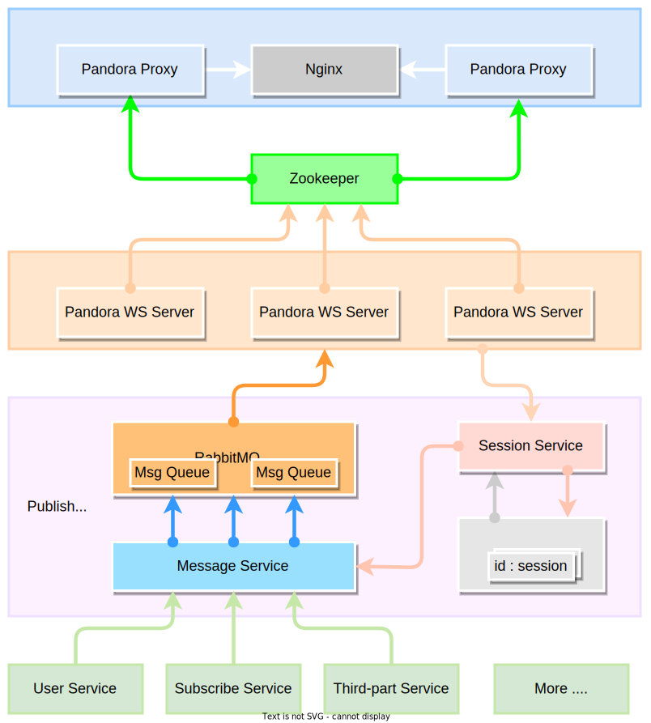

# pandora

A high-performance websocket gateway which supports horizontal expansion and load balancing.

## Core Feature

- Websocket Gateway
- Message Publish
- Instant Message

## Architecture

## MIT License

Khighness's pandora is open-sourced system licensed under the [MIT license](https://github.com/Khighness/pandora/blob/master/LICENSE).