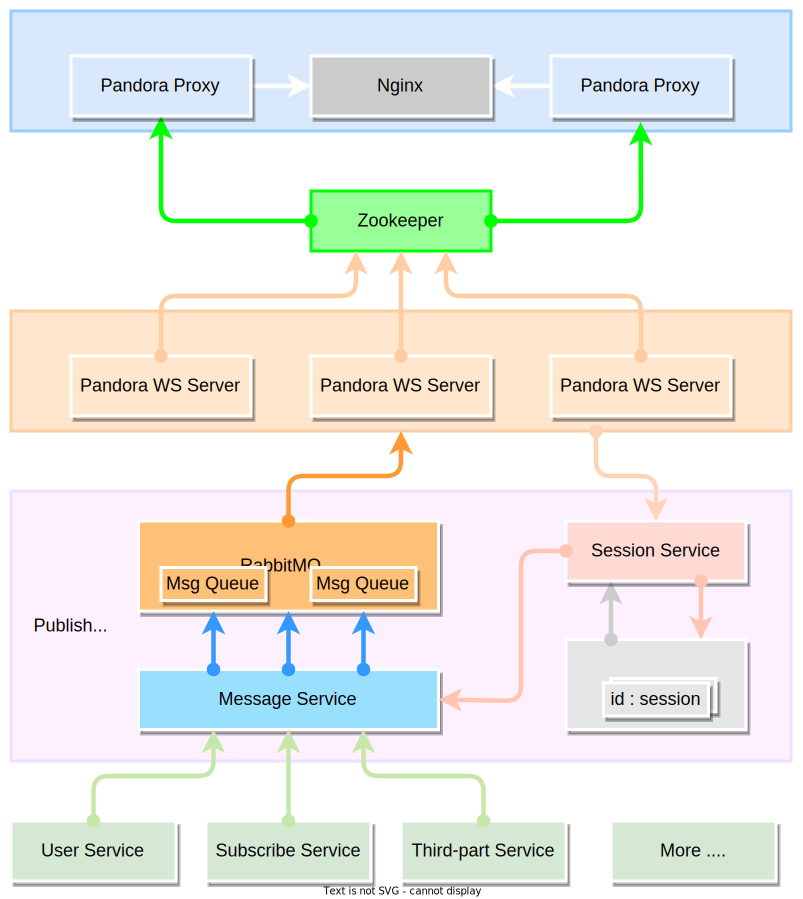

# pandora

A high-performance websocket gateway which supports horizontal expansion and load balancing.

## Core Feature

- websocket gateway
- message publish
- instant messaging

## Architecture

## MIT License

Khighness's pandora is open-sourced system licensed under the [MIT license](https://github.com/Khighness/pandora/blob/master/LICENSE).